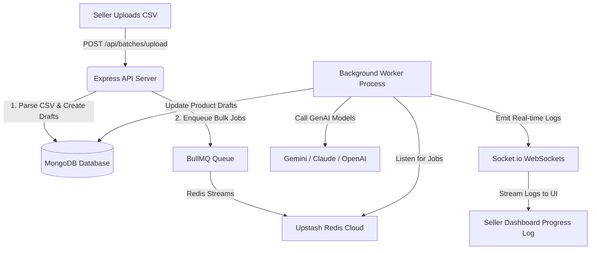

# Flipkart-Genius: AI-Powered Bulk Product Upload Platform

An advanced, enterprise-grade MERN-stack seller dashboard that automates bulk inventory uploads using an asynchronous processing pipeline powered by Redis, BullMQ, and GenAI services.

## 🚀 Key Features

1. **Auto-Generated SEO Titles & Descriptions (GenAI)**: Automatically compiles high-quality product titles, search keywords, and 4-point bullet descriptions.
2. **Image-to-Attribute Extraction (Multimodal Vision)**: Extracts color patterns, fabrics, and product attributes directly from uploaded image URLs.
3. **Smart Category Classification**: Automatically maps raw CSV categories to exact database taxonomies.
4. **0.6 Confidence Guardrail Fallback**: Products with AI confidence below 60% are flagged for manual seller review (AI Safety).
5. **Spreadsheet-style Auditing (AG Grid)**: Real-time bulk editing and deletion directly inside a premium tabular interface.
6. **Live Logging Terminal (Socket.io & BullMQ)**: Background worker tasks stream logs directly to the browser screen via WebSockets.

---

## 🏗️ Architecture Design



---

## 🛠️ Technology Stack

* **Frontend**: React (Vite), TailwindCSS, AG Grid, Socket.io Client, Axios, Lucide Icons.
* **Backend**: Node.js, Express, MongoDB (Mongoose ORM), Redis, BullMQ, Socket.io Server, Multer.
* **AI Provider**: Google Generative AI (Gemini Pro SDK), Anthropic Claude, OpenAI, or dynamic rule-based fallbacks.

---

## 📦 Project Directory Layout

```text
Flipkart-Genius/
├── frontend/               # React Client Codebase
│   ├── src/
│   │   ├── components/     # UI widgets (Spreadsheet row comparisons, Progress trackers)
│   │   ├── pages/          # Login, Register, Dashboard, BulkUpload, ReviewBatch
│   │   └── services/       # Socket.io Client & Axios instance configurations
│   └── tests/              # Vitest Frontend Tests (Login/Register/Dashboard)
│
└── backend/                # Express API Server Codebase
    ├── config/             # DB connector configs
    ├── controllers/        # Auth, Batch, and Product business logic
    ├── models/             # Mongoose Schemas (User, UploadBatch, Product)
    ├── queues/             # Redis client & BullMQ Queue setup
    ├── services/           # Gemini & LLM client providers
    └── workers/            # BullMQ background task processor threads
```

---

## ⚙️ How to Setup & Run

### 1. Install Backend
1. Go to the backend folder:
   ```bash
   cd backend
   ```
2. Set up environment variables by copying `.env.example` to `.env` and adding your Upstash Redis credentials and Gemini API Key:
   ```bash
   cp .env.example .env
   ```
3. Install packages and start server:
   ```bash
   npm install
   ```
   ```bash
   npm run dev
   ```

### 2. Install Frontend
1. Go to the frontend folder:
   ```bash
   cd ../frontend
   ```
2. Install packages and run development server:
   ```bash
   npm install
   ```
   ```bash
   npm run dev
   ```
3. Open `http://localhost:3000` in your browser.

---

## 🔮 Future Work (Interview Discussion Points)
* **Natural Language Bulk Editing**: Allow sellers to write queries like *"reduce price by 10% on all shirts"* to bulk update records.
* **Image-Based Duplicate Detection**: Run image similarity embeddings (e.g. Cosine Similarity via vector DBs) to flag duplicate uploads.
* **Multi-Platform Inventory Sync**: Connect APIs to sync catalogs to Flipkart, Amazon, and Shopify simultaneously.
